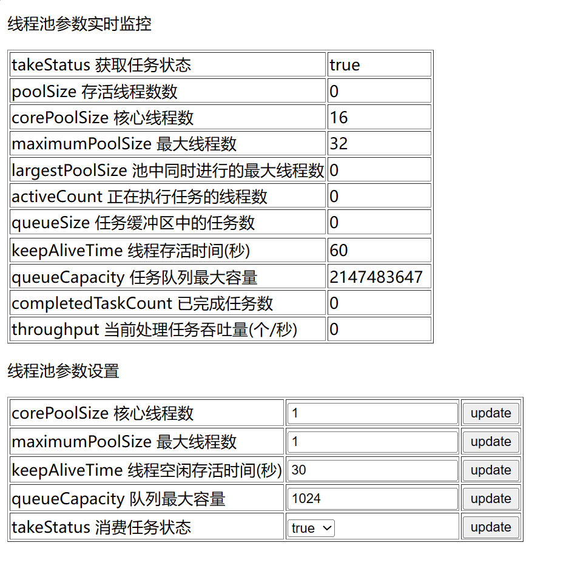

# haidnorExecutor
Java 动态弹性线程池实现。快速集成于 SpringBoot 项目。提供 WEB 线程池控制页面，可实时查看线程池运行信息，动态修改线程池运行参数，暂停启动线程池运行状态。

# MAVEN 
```xml
<dependency>
    <groupId>haidnor</groupId>
    <artifactId>haidnor-executor</artifactId>
    <version>1.0</version>
</dependency>
```

# 动态线程池控制台
服务启动后访问链接 http://127.0.0.1:8080/thread.html 可进入线程池控制台。可对线程池进行动态设置。


# API
获取动态线程池
```java
ThreadPoolExecutor executor = ThreadPoolService.getExecutor();
```